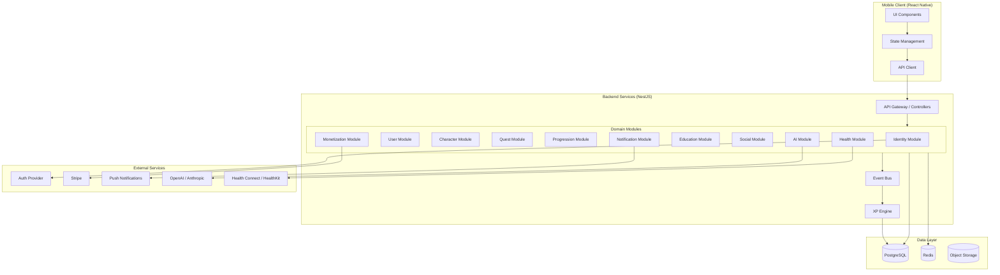

# LifeXP
## Technical Architecture Document (TAD)

**Product Name:** LifeXP  
**Document Version:** 1.0  
**Date:** July 23, 2026  
**Status:** Implementation-Ready Architecture  
**Prepared by:** Principal Software Architect & CTO  
**Audience:** Engineering Teams, Technical Leads, AI Coding Agents, DevOps  

---

## Table of Contents
1. Executive Architecture Summary  
2. Technology Stack  
3. High-Level System Architecture  
4. Modular System Modules  
5. Modularity and Boundaries  
6. Data Flow Architecture  
7. Event-Driven Design  
8. XP Engine Architecture  
9. Progression Architecture  
10. Quest Architecture  
11. Health Data Architecture  
12. AI Architecture  
13. Security Architecture  
14. Privacy Architecture  
15. Scalability Architecture  
16. Reliability Architecture  
17. Observability  
18. Testing Strategy  
19. Deployment Architecture  
20. AI Coding Agent Development Rules  
21. Architecture Decision Records  
22. Recommended Implementation Order  

---

## 1. Executive Architecture Summary

LifeXP follows a **modular, event-driven, layered architecture** designed for incremental development across 10+ phases.

**Core Design Principles:**
- **Clean boundaries** between domain modules (especially Quest → Progression separation)
- **Event-driven communication** for loose coupling
- **Domain-driven design** with clearly defined bounded contexts
- **Mobile-first** with backend services
- **Future-proof** extensibility for AI, social, and integrations
- **Auditability** for all gamification and health data
- **Responsible health design** with safety layers

**Architecture Style:**  
Modular monolith initially (Phase 1–5), transitioning to service-oriented architecture for later phases.

**Key Components:**
- **Frontend:** Mobile application (React Native)
- **Backend:** API layer + domain services
- **Database:** PostgreSQL (relational + JSON for flexibility)
- **Event Bus:** In-process event emitter (early) → Redis-backed queue (later)
- **Progression Engine:** Authoritative XP ledger + attribute calculators
- **Health Data Layer:** Normalized ingestion with verification metadata

The architecture ensures that:
- The XP system is never hardcoded into UI or Quest logic
- Quests only emit completion events
- Progression, achievements, and levels are handled by dedicated services
- All critical calculations are testable and auditable

---

## 2. Technology Stack

### Frontend

**Recommended:** React Native (Expo) + TypeScript

**Why:**
- Excellent mobile-first experience
- Strong TypeScript support and developer velocity
- Large ecosystem and AI-agent compatibility
- Expo for rapid development and over-the-air updates

**Advantages:**
- Single codebase for iOS and Android
- Rich component ecosystem
- Strong community and long-term support
- Easy integration with React Query, Zod, etc.

**Disadvantages:**
- Performance slightly lower than native for complex animations (mitigated by Reanimated)
- Occasional native module complexity

**Scalability Implications:** Excellent for 100k+ users with proper state management.

**Alternatives Considered:**
- Flutter: Better performance but less AI-agent friendly ecosystem
- SwiftUI + Kotlin Multiplatform: Higher maintenance cost

**Stack Details:**
- Framework: React Native (Expo SDK 51+)
- Language: TypeScript
- UI: NativeWind (Tailwind) + Tamagui or React Native Paper
- State: React Query (TanStack) + Zustand
- Forms: React Hook Form + Zod
- Navigation: React Navigation v6
- Data Fetching: React Query with optimistic updates

### Backend

**Recommended:** Node.js + NestJS (TypeScript)

**Why:**
- Strong TypeScript ecosystem alignment with frontend
- Excellent modularity and dependency injection
- Built-in support for clean architecture patterns
- Mature validation, guards, and interceptors

**Advantages:**
- High developer velocity
- Excellent for domain-driven design
- Strong testing support
- Easy to evolve into microservices later

**Disadvantages:**
- Node.js single-threaded (mitigated by clustering and queues)

**Scalability Implications:** Handles 100k+ concurrent users easily with proper caching.

**Alternatives Considered:**
- Python + FastAPI: Slightly slower development for complex business logic
- Go: Excellent performance but lower productivity for complex domains

**Stack Details:**
- Runtime: Node.js 20 LTS
- Framework: NestJS
- API: REST + GraphQL (optional later)
- Validation: class-validator + class-transformer
- Authentication: JWT + Passport.js strategies
- Authorization: CASL or custom role/permission system

### Database

**Recommended:** PostgreSQL 16

**Why:**
- Strong ACID compliance (critical for XP ledger and health data)
- Excellent JSON support for flexible attributes
- Mature ecosystem and tooling
- Great for complex queries and analytics

**ORM:** Prisma (TypeScript-first, excellent migrations, type safety)

**Advantages:**
- Type-safe queries
- Powerful migration system
- Strong community support

**Disadvantages:**
- Slightly less flexible than raw SQL for complex reporting (mitigated by views)

**Alternatives Considered:**
- MySQL: Less feature-rich JSON support
- MongoDB: Loses relational integrity needed for transactions and XP history

### Infrastructure & Supporting Services

| Component              | Technology                          | Rationale |
|------------------------|-------------------------------------|---------|
| Hosting & Deployment   | Railway / Vercel / AWS              | Simple, scalable, cost-effective |
| Containerization       | Docker + Docker Compose             | Consistency across environments |
| CI/CD                  | GitHub Actions                      | Native integration, free tier |
| Caching                | Redis (BullMQ for queues)           | Event processing, rate limiting, sessions |
| File Storage           | AWS S3 or Cloudflare R2             | Shareable cards, avatars |
| Email                  | Resend or Postmark                  | Transactional emails |
| Push Notifications     | Expo Push Notifications / OneSignal | Mobile-first |
| Analytics              | PostHog or Mixpanel + custom        | Product + technical metrics |
| Error Tracking         | Sentry                              | Real-time error monitoring |
| Logging                | Pino + structured JSON              | Centralized logging |
| Payments               | Stripe                              | Subscriptions & future marketplace |
| AI Gateway             | Custom abstraction + LangChain      | Multi-provider support |

**AI Provider Abstraction:** OpenAI, Anthropic, Groq (for speed)

---

## 3. High-Level System Architecture

**Architecture Diagram (Mermaid):**



**Communication Patterns:**
- Frontend ↔ Backend: REST (primary) + WebSocket (real-time streaks/notifications)
- Inter-module: Domain Events (via EventEmitter or BullMQ)
- Database: Direct via Prisma (with transaction support)

---

## 4. Modular System Modules

### 4.1 Identity Module
**Responsibilities:**
- User registration, login, password reset
- Session management and JWT handling
- OAuth providers (Google, Apple)
- Account verification

**Data Ownership:** `users`, `sessions`, `auth_providers`

### 4.2 User Module
**Responsibilities:**
- Profile data (username, age, gender, height, weight)
- Preferences and settings
- Goals and primary objectives
- Privacy controls

**Data Ownership:** `profiles`, `user_preferences`, `user_goals`

### 4.3 Character Module
**Responsibilities:**
- Archetype selection and management
- Initial attribute seeding
- Character visual identity (future)
- Goal-to-archetype mapping

**Data Ownership:** `characters`, `character_archetypes`

### 4.4 Progression Module
**Responsibilities:**
- XP transactions and ledger
- Level calculation
- Attribute progression
- Titles, achievements, rewards
- Anti-abuse and caps enforcement

**Data Ownership:** `xp_transactions`, `user_levels`, `user_attributes`, `achievements`

### 4.5 Quest Module
**Responsibilities:**
- Quest definitions and templates
- Daily/weekly quest generation
- Quest instance lifecycle
- Completion and validation logic
- Quest-to-XP reward mapping

**Data Ownership:** `quest_definitions`, `quest_instances`, `quest_completions`

### 4.6 Habit Module (Streaks)
**Responsibilities:**
- Streak calculation and maintenance
- Streak shields (V2)
- Consistency scoring
- Milestone tracking

**Data Ownership:** `streaks`, `streak_shields`, `streak_history`

### 4.7 Health Module
**Responsibilities:**
- Activity, workout, steps, water, sleep, nutrition ingestion
- Verification status tracking
- Source attribution
- Health data aggregation

**Data Ownership:** `health_activities`, `workouts`, `sleep_logs`, `hydration_logs`, `nutrition_logs`

### 4.8 Education Module
**Responsibilities:**
- Lessons, courses, quizzes
- Progress tracking
- Knowledge XP distribution
- Content versioning

**Data Ownership:** `courses`, `lessons`, `lesson_progress`, `quiz_attempts`

### 4.9 AI Module
**Responsibilities:**
- Context assembly
- Prompt management
- Safety filtering
- Conversation storage
- Provider abstraction

**Data Ownership:** `ai_conversations`, `ai_context_snapshots`

### 4.10 Social Module
**Responsibilities:**
- Friend relationships
- Challenges and groups
- Leaderboards and leagues
- Privacy controls for sharing

**Data Ownership:** `friendships`, `challenges`, `challenge_participants`

### 4.11 Sharing Module
**Responsibilities:**
- Progress card generation
- Shareable image creation
- Link generation and tracking

### 4.12 Monetization Module
**Responsibilities:**
- Subscription plans and entitlements
- Payment processing (via Stripe)
- Feature gating
- Invoice and billing history

### 4.13 Notification Module
**Responsibilities:**
- Push, email, and in-app notifications
- Notification preferences
- Smart scheduling (streak reminders, quest alerts)

---

## 5. Modularity and Boundaries

**Core Rule:**  
No module may directly mutate another module’s data. All cross-module communication occurs through:

1. Domain Events
2. Well-defined service interfaces
3. Read-only queries where appropriate

**Example Boundary — Quest & Progression:**

```
Quest Module
├── QuestCompletedEvent (emitted)
└── Never directly calls ProgressionService

Progression Module
├── Listens to QuestCompletedEvent
├── Evaluates reward rules
├── Creates XP transaction
└── Updates attributes and levels
```

**Allowed Dependencies:**
- All modules → Shared infrastructure (Prisma, Redis, EventBus)
- Progression Module → Quest Module (read-only for reward definitions)

**Forbidden Dependencies:**
- Quest Module → Progression Module (direct mutation)
- UI Components → XP Engine (direct access)

**Shared Services:**
- EventBus
- IdempotencyService
- AuditLogger
- ValidationService

---

## 6. Data Flow Architecture

### 6.1 User Registration Flow

```
User (Mobile)
   ↓
Frontend Form
   ↓
POST /auth/register
   ↓
Identity Module
   ├── Create User record
   ├── Create Profile
   └── Emit UserRegistered
   ↓
Character Module (onboarding)
   └── Create Character + Archetype
```

### 6.2 Quest Completion Flow (Critical)

```
User taps "Complete Quest"
   ↓
Quest UI validates local state
   ↓
POST /quests/:id/complete
   ↓
Quest Module
   ├── Validate quest instance
   ├── Create QuestCompletion record
   └── Emit QuestCompletedEvent
         ↓
Progression Module (async listener)
   ├── Evaluate reward rules
   ├── Create XPTransaction (idempotent)
   ├── Update UserAttributes
   ├── Calculate new Level
   ├── Check for Achievements
   └── Emit LevelUp / AchievementUnlocked
         ↓
Notification Module
   └── Send push / in-app notification
```

### 6.3 Health Activity Flow

```
User logs water or device syncs steps
   ↓
Health Module
   ├── Create HealthActivity record
   ├── Set verification_status = 'self' | 'device'
   └── Emit ActivityRecordedEvent
         ↓
Progression Module
   └── Evaluate XP eligibility
```

### 6.4 AI Coach Request Flow

```
User sends message
   ↓
AI Module
   ├── Retrieve recent context (goals, streaks, last 7 days activity)
   ├── Build prompt with safety instructions
   ├── Call AI Provider (via abstraction)
   ├── Apply safety filter
   └── Store conversation + response
```

---

## 7. Event-Driven Design

**Event System:**  
Initially: In-process `EventEmitter` (NestJS)  
Later: BullMQ + Redis for asynchronous processing

**Core Domain Events:**

| Event Name                  | Producer              | Payload                                      | Consumers                          | Sync/Async |
|----------------------------|-----------------------|----------------------------------------------|------------------------------------|------------|
| `UserRegistered`           | Identity Module       | userId, email, timestamp                     | Character, Notification            | Async      |
| `ProfileCompleted`         | User Module           | userId, profileData                          | Character                          | Async      |
| `CharacterCreated`         | Character Module      | userId, archetype, goals                     | Quest, Progression                 | Async      |
| `QuestCompleted`           | Quest Module          | userId, questId, completionId, timestamp     | Progression, Habit, Notification   | Async      |
| `ActivityRecorded`         | Health Module         | userId, activityType, value, source          | Progression                        | Async      |
| `XPGranted`                | Progression Module    | userId, amount, category, sourceId           | Notification, Analytics            | Async      |
| `LevelUp`                  | Progression Module    | userId, newLevel, oldLevel                   | Notification, Character            | Async      |
| `AchievementUnlocked`      | Progression Module    | userId, achievementId                        | Notification, Social               | Async      |
| `StreakExtended`           | Habit Module          | userId, streakLength                         | Notification                       | Async      |
| `StreakBroken`             | Habit Module          | userId, previousLength                       | Notification                       | Async      |
| `CourseCompleted`          | Education Module      | userId, courseId                             | Progression                        | Async      |
| `SubscriptionChanged`      | Monetization Module   | userId, plan, status                         | Entitlement, Notification          | Async      |

**Duplicate Prevention:**
- Every event includes a unique `eventId` (UUID)
- Consumers use idempotency keys (eventId + handler)
- Redis-based deduplication for critical events

---

## 8. XP Engine Architecture

**Design Principles:**
- Authoritative source of truth = `xp_transactions` table (append-only ledger)
- Never mutate `user_xp_total` directly
- All XP changes must create a transaction record

**Core Components:**

### 8.1 XP Source Definitions
- Stored in `xp_reward_rules` table
- Fields: `source_type`, `category`, `base_xp`, `daily_cap`, `cooldown_minutes`

### 8.2 XP Transaction Ledger
```sql
xp_transactions (
  id UUID PRIMARY KEY,
  user_id UUID,
  source_type VARCHAR,           -- 'quest', 'activity', 'lesson'
  source_id UUID,
  category VARCHAR,              -- 'strength', 'endurance', etc.
  amount INTEGER,
  metadata JSONB,
  created_at TIMESTAMP
)
```

### 8.3 Key Rules
- **Daily Cap per Category:** Enforced at transaction creation time
- **Idempotency:** `source_id` + `source_type` must be unique per user
- **Reversal:** Negative transactions supported with audit trail
- **Anti-abuse:** Velocity checks + anomaly detection (future)

**Flow:**
```
Validated Action
   ↓
Reward Evaluator (reads xp_reward_rules)
   ↓
Create XPTransaction (with idempotency check)
   ↓
Aggregate user_xp_total (materialized view or trigger)
   ↓
Attribute progression calculator
```

---

## 9. Progression Architecture

**Data Model:**
- `user_levels` — global level
- `user_attributes` — 7 attributes with current value + history
- `user_titles` — unlocked titles
- `user_achievements` — unlocked achievements

**Calculation Strategy:**
- Level and attribute calculations are deterministic functions
- All calculations are pure and testable
- Progression rules stored in configuration tables (not hardcoded)

**Extensibility:**
- New attributes or titles can be added via configuration
- No schema changes required for most progression updates

---

## 10. Quest Architecture

**Key Entities:**
- `quest_definitions` — reusable templates
- `quest_instances` — daily/weekly assignments to users
- `quest_completions` — user submissions

**Generation Strategy:**
- Nightly background job (cron) generates daily quests for all active users
- Uses archetype + goals + recent activity to personalize
- Future: AI-generated quests via Quest Module interface

**Validation:**
- Quest Module owns validation rules
- Supports multiple validation types (manual, device, future AI)

---

## 11. Health Data Architecture

**Core Table:** `health_activities`

```sql
health_activities (
  id UUID,
  user_id UUID,
  activity_type VARCHAR,         -- 'steps', 'workout', 'water', 'sleep'
  value NUMERIC,
  unit VARCHAR,
  source VARCHAR,                -- 'manual', 'health_connect', 'apple_health'
  verification_status VARCHAR,   -- 'self', 'device', 'coach'
  confidence_score FLOAT,
  recorded_at TIMESTAMP,
  metadata JSONB
)
```

**Design Goals:**
- Single normalized table for all health metrics
- Future integrations add new `source` values without schema changes
- Clear distinction between user-entered and device data

---

## 12. AI Architecture

**Design:** Provider-agnostic abstraction layer

**Components:**
- `AIProvider` interface (abstract)
- Concrete implementations: `OpenAIProvider`, `AnthropicProvider`
- `ContextBuilder` service — assembles user state
- `SafetyFilter` — strips medical claims, enforces wellness-only responses
- `ConversationStore` — stores full conversation history

**Rate Limits & Cost Controls:**
- Per-user daily token limits
- Caching of common responses
- Fallback to rule-based responses when needed

---

## 13. Security Architecture

- **Authentication:** JWT with short expiry + refresh tokens
- **Authorization:** Role + Permission-based (CASL)
- **Input Validation:** Strict DTO validation on all endpoints
- **Rate Limiting:** Per-user and per-IP limits (Redis)
- **Encryption:** TLS 1.3 + database encryption for sensitive fields
- **Health Data:** Additional access logging and consent tracking
- **Secrets:** Managed via environment variables + secret manager (Railway/AWS Secrets)

---

## 14. Privacy Architecture

- Data minimization principle
- Granular consent management (per data category)
- Right to deletion and export (GDPR/DPDP compliant)
- Health data access requires explicit consent
- Third-party sharing only with explicit user approval
- Retention policies: 3 years for active users, 90 days after deletion request

---

## 15. Scalability Architecture

**Phase 1–3 (Hundreds to Thousands):**
- Single PostgreSQL instance
- In-process event handling
- Basic Redis caching

**Phase 4–6 (Tens of Thousands):**
- Read replicas
- BullMQ for background jobs
- CDN for static assets

**Phase 7+ (Hundreds of Thousands+):**
- Horizontal scaling of API servers
- Database sharding (user_id based)
- Dedicated AI service with cost controls
- Event-driven microservices for Progression and Quest

---

## 16. Reliability Architecture

- Database transactions for all financial/gamification operations
- Idempotency keys on all critical operations
- Circuit breakers for external services (AI, payments)
- Graceful degradation (AI coach falls back to static advice)
- Automated daily backups + point-in-time recovery
- Retry with exponential backoff for transient failures

---

## 17. Observability

**Metrics:**
- Quest completion rate
- XP distribution per category
- Streak distribution
- API latency p50/p95/p99
- Error rate per endpoint

**Tools:**
- Sentry (errors)
- PostHog (product analytics)
- Prometheus + Grafana (infrastructure)
- Structured JSON logs (Pino)

---

## 18. Testing Strategy

**Priority Order:**
1. **XP Engine** — 100% coverage (pure functions + ledger tests)
2. **Quest Completion & Validation**
3. **Streak Calculations**
4. **Progression & Level calculations**
5. **Health Data Ingestion**
6. **Event handlers** (idempotency tests)
7. **Subscription entitlements**

**Testing Layers:**
- Unit tests for all domain services
- Integration tests for event flows
- API contract tests
- End-to-end critical user journeys
- Load testing on XP and Quest endpoints

---

## 19. Deployment Architecture

**Environments:**
- **Development:** Local Docker Compose
- **Staging:** Railway staging environment (mirrors production)
- **Production:** Railway / AWS with blue-green or canary deployments

**CI/CD:**
- GitHub Actions: lint → test → build → deploy
- Database migrations run automatically on deploy (Prisma)
- Feature flags for gradual rollout

**Rollback Strategy:**
- Database migrations are forward-only with down migrations available
- Quick rollback via previous Docker image tag

---

## 20. AI Coding Agent Development Rules

When implementing features:

1. Read and understand the current architecture document before making changes.
2. Never bypass module boundaries or event-driven patterns.
3. Always create auditable XP transactions — never mutate totals directly.
4. Write tests for any new logic in the XP, Quest, or Progression modules.
5. Use existing event patterns instead of creating new direct service calls.
6. Keep all secrets in environment variables only.
7. Document any new architectural decisions in the ADR section.
8. Validate that changes do not break existing user journeys.
9. Prefer configuration-driven progression rules over hardcoded logic.
10. Maintain backward compatibility for data models.

---

## 21. Architecture Decision Records (ADRs)

### ADR-001: Frontend Framework
**Decision:** React Native (Expo) + TypeScript  
**Context:** Need mobile-first app with high developer velocity.  
**Alternatives:** Flutter, Native iOS/Android.  
**Reasoning:** Strong TypeScript alignment, Expo ecosystem, AI-agent compatibility.  
**Consequences:** Slightly higher bundle size; mitigated by code-splitting.

### ADR-002: Backend Framework
**Decision:** NestJS (Node.js)  
**Context:** Need modular, testable backend with strong typing.  
**Alternatives:** FastAPI, Express.  
**Reasoning:** Built-in DI, decorators, and clean architecture patterns.

### ADR-003: Database
**Decision:** PostgreSQL + Prisma  
**Context:** Need strong consistency for XP ledger and health data.  
**Alternatives:** MongoDB.  
**Reasoning:** ACID compliance and relational integrity are non-negotiable.

### ADR-004: Event System
**Decision:** Start with in-process events, evolve to BullMQ.  
**Context:** Avoid premature complexity in MVP.  
**Reasoning:** Simple to implement initially; easy migration path.

### ADR-005: XP Engine
**Decision:** Append-only transaction ledger as source of truth.  
**Context:** Prevent silent corruption of progression data.  
**Reasoning:** Auditability and reversibility are critical.

### ADR-006: AI Abstraction
**Decision:** Provider interface with safety layer.  
**Context:** Avoid vendor lock-in and medical liability.  
**Reasoning:** Future-proofs the system and enforces wellness-only behavior.

### ADR-007: Health Data Model
**Decision:** Single normalized `health_activities` table.  
**Context:** Support future integrations without schema explosion.  
**Reasoning:** Flexibility and simplicity.

### ADR-008: Authentication
**Decision:** JWT + refresh tokens + OAuth providers.  
**Context:** Secure, mobile-friendly auth.  
**Reasoning:** Industry standard with good mobile support.

### ADR-009: Payments
**Decision:** Stripe for subscriptions.  
**Context:** Reliable subscription management.  
**Reasoning:** Best-in-class developer experience and webhook reliability.

### ADR-010: Deployment
**Decision:** Railway for early phases, AWS for scale.  
**Context:** Balance simplicity and cost.  
**Reasoning:** Fast iteration in early stages.

---

## 22. Recommended Implementation Order

**Phase-Aligned Order:**

1. **Phase 1** — Identity + User + Database foundation
2. **Phase 2** — Character Module + Onboarding flows
3. **Phase 3** — Progression Module (XP Engine, Levels, Attributes)
4. **Phase 4** — Quest Module + Daily quest generation
5. **Phase 5** — Habit Module (Streaks)
6. **Phase 6** — Education Module
7. **Phase 7** — Health Module + basic tracking
8. **Phase 8** — AI Module (abstraction first)
9. **Phase 9** — Social Module
10. **Phase 10** — Monetization + Sharing

**Critical Path:**  
Progression Module must be implemented before Quest Module (to handle rewards).

---

**Document End**

This Technical Architecture Document provides the complete foundation for building LifeXP. All implementation work must strictly adhere to the module boundaries, event-driven patterns, and XP ledger rules defined herein.

**Next Step:** Phase 0 — Complete Database Schema Design.