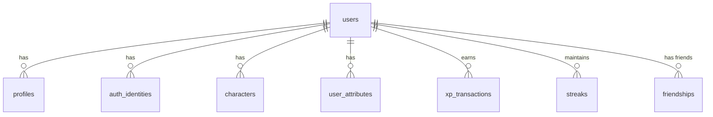
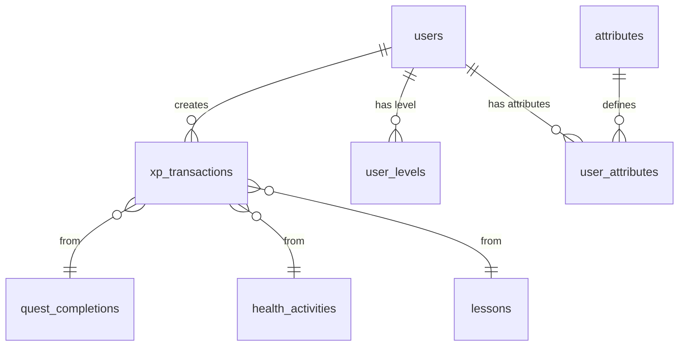
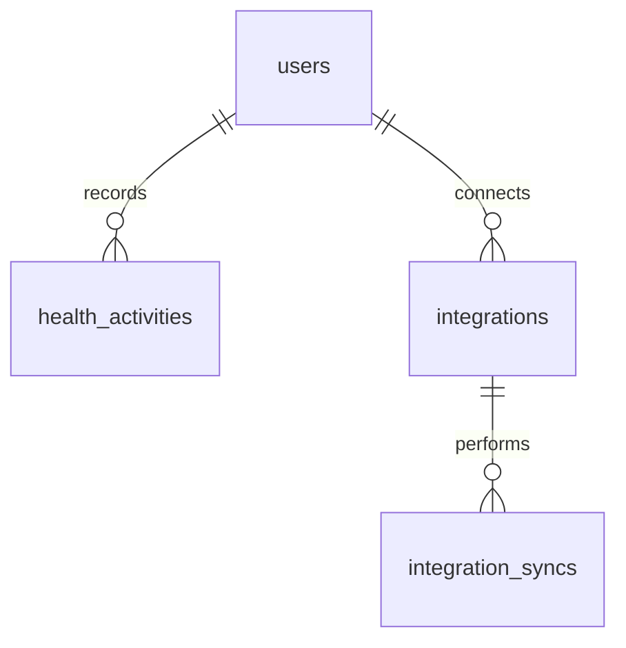
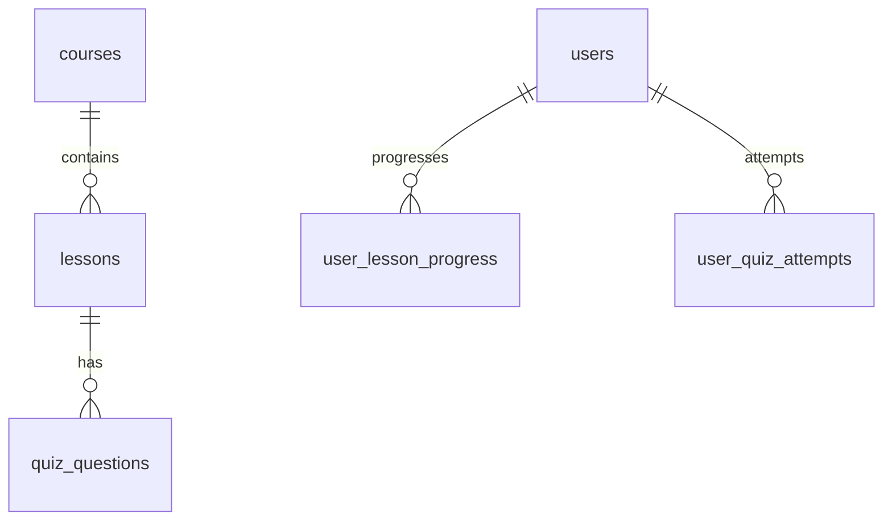
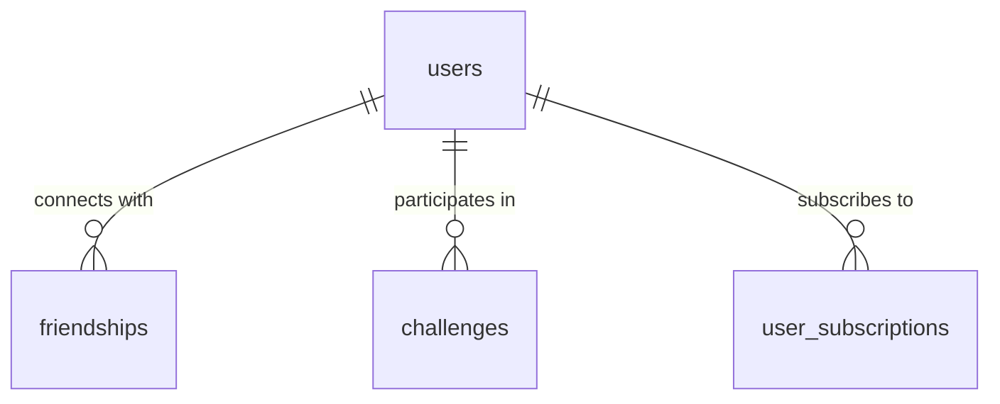

# LifeXP
## Complete Database Schema Design

**Product Name:** LifeXP  
**Document Version:** 1.0  
**Date:** July 23, 2026  
**Status:** Production-Ready Schema Design  
**Prepared by:** Principal Database Architect  
**Audience:** Engineering, Backend Team, AI Coding Agents  

---

## Table of Contents

1. Database Architecture Summary  
2. Database Technology Recommendation  
3. Data Modelling Principles  
4. Identity Schema  
5. User Profile Schema  
6. Character Schema  
7. Attribute Schema  
8. XP Ledger Schema  
9. Level Schema  
10. Quest Schema  
11. Quest Validation Schema  
12. Health Data Schema  
13. Integration Schema  
14. Streak Schema  
15. Achievement Schema  
16. Reward Schema  
17. Health Academy Schema  
18. AI Coach Schema  
19. Social Schema  
20. Challenge Schema  
21. League Schema  
22. Notification Schema  
23. Sharing Schema  
24. Monetization Schema  
25. Referral Schema  
26. Audit and Security Schema  
27. Complete ER Diagrams  
28. Table-by-Table Specifications  
29. Constraints and Integrity Rules  
30. Indexing Strategy  
31. Privacy and Data Retention  
32. Migration Strategy  
33. Exact MVP Database Scope  
34. Recommended Implementation Order  

---

## 1. Database Architecture Summary

LifeXP uses a **relational database** with strong emphasis on data integrity, auditability, and extensibility. The schema is designed around **domain-driven bounded contexts** that mirror the modular architecture defined in the Technical Architecture Document.

**Core Design Goals:**
- Authoritative append-only XP ledger
- Clear separation between Quest and Progression domains
- Flexible attribute and health data models
- Support for incremental rollout across 10 development phases
- GDPR + India DPDP compliance ready
- High performance for daily dashboard queries

**Key Characteristics:**
- UUID primary keys for security and distributed systems
- Soft deletes for user data
- JSONB columns for flexible metadata
- Materialized views for performance-critical aggregations
- Strong foreign key constraints

---

## 2. Database Technology Recommendation

**Primary Database:** PostgreSQL 16

**ORM:** Prisma (TypeScript)

**Rationale:**
- Excellent ACID compliance (critical for XP transactions)
- Superior JSONB support for flexible health data and metadata
- Mature migration system
- Strong typing with Prisma
- Excellent performance for analytical queries on health and progression data

**Alternatives Considered:**
- MySQL: Weaker JSON support
- MongoDB: Loses relational integrity needed for XP ledger and health data relationships

**Additional Tools:**
- Redis (for caching and idempotency keys)
- Prisma Migrate for schema evolution

---

## 3. Data Modelling Principles

- **Normalization:** 3NF for core transactional tables; JSONB for flexible metadata
- **Auditability:** Every XP change is a transaction record
- **Idempotency:** Unique constraints on critical operations
- **Extensibility:** Use of `metadata JSONB` columns and configuration tables
- **Privacy:** Sensitive health data is isolated and consent-tracked
- **Performance:** Indexes on all high-frequency query paths
- **MVP Focus:** Only essential tables for core loop

---

## 4. Identity Schema

**Tables:**
- `users`
- `auth_identities`
- `sessions`
- `user_preferences`

**Design Notes:**
- `users` is the central identity table
- Supports multiple authentication methods via `auth_identities`
- Soft delete via `deleted_at`
- Timezone stored per user

---

## 5. User Profile Schema

**Tables:**
- `profiles`
- `user_goals`

**Design Notes:**
- Health data (height, weight, activity_level) stored in `profiles`
- Goals stored as many-to-many in `user_goals`
- Gender and DOB stored optionally with privacy considerations
- All profile fields are user-editable

---

## 6. Character Schema

**Tables:**
- `characters`
- `character_archetypes`
- `character_goals`

**Design Notes:**
- Archetypes are stored in a lookup table (`character_archetypes`)
- Users can change archetype later (not locked)
- Goals linked to characters

---

## 7. Attribute Schema

**Tables:**
- `attributes` (lookup)
- `user_attributes`
- `user_attribute_history`

**Design Notes:**
- `attributes` table allows new attributes without schema changes
- `user_attributes` stores current value
- History table enables progression tracking

---

## 8. XP Ledger Schema

**Tables:**
- `xp_transactions`

**Critical Design:**
This is the **authoritative source of truth** for all progression.

- Append-only table
- Never mutate totals directly
- Every grant, reversal, or correction creates a row
- `source_type` + `source_id` provides idempotency

---

## 9. Level Schema

**Tables:**
- `levels` (configuration)
- `user_levels`
- `level_up_history`

**Design Notes:**
- `levels` table defines XP thresholds (configurable)
- `user_levels` stores current level
- History enables audit of level progression

---

## 10. Quest Schema

**Tables:**
- `quest_definitions`
- `quest_instances`
- `quest_completions`

**Design Notes:**
- Clear separation between definition, instance, and completion
- Supports daily, weekly, recurring, and personalized quests
- `quest_instances` generated nightly

---

## 11. Quest Validation Schema

**Tables:**
- Integrated into `quest_completions` via `verification_status` and `verification_source`

**Design Notes:**
- Supports self, device, AI, and coach verification
- Future verification methods added via enum extension

---

## 12. Health Data Schema

**Tables:**
- `health_activities` (unified table for steps, workouts, water, sleep, weight, nutrition)

**Design Notes:**
- Single normalized table for all health metrics
- `activity_type` distinguishes data type
- `source` and `verification_status` fields support multiple origins

---

## 13. Integration Schema

**Tables:**
- `integrations`
- `integration_syncs`

**Design Notes:**
- Generic integration model
- Supports Health Connect, Apple Health, wearables
- Stores external IDs and sync metadata

---

## 14. Streak Schema

**Tables:**
- `streaks`
- `streak_events`
- `streak_shields` (V2)

**Design Notes:**
- `streaks` holds current active streak
- `streak_events` provides full audit history

---

## 15. Achievement Schema

**Tables:**
- `achievements`
- `user_achievements`

**Design Notes:**
- `achievements` table defines conditions
- Unlocks recorded in `user_achievements`

---

## 16. Reward Schema

**Tables:**
- `rewards`
- `user_rewards`

**Design Notes:**
- Flexible reward system (titles, badges, future marketplace items)

---

## 17. Health Academy Schema

**Tables:**
- `courses`
- `lessons`
- `quiz_questions`
- `quiz_options`
- `user_lesson_progress`
- `user_quiz_attempts`

**Design Notes:**
- Content is versioned and extensible
- Progress tracking per lesson

---

## 18. AI Coach Schema

**Tables:**
- `ai_conversations`
- `ai_messages`

**Design Notes:**
- Stores conversation history
- Includes model metadata and cost tracking
- Safety flags for content review

---

## 19. Social Schema

**Tables:**
- `friendships`
- `friend_requests`
- `blocks`

**Design Notes:**
- Prevents duplicate relationships and self-friending

---

## 20. Challenge Schema

**Tables:**
- `challenges`
- `challenge_participants`
- `challenge_progress`

---

## 21. League Schema

**Tables:**
- `leagues`
- `league_seasons`
- `league_memberships`
- `league_rankings`

**Design Notes:**
- Supports multiple ranking types (consistency, improvement)

---

## 22. Notification Schema

**Tables:**
- `notifications`
- `notification_preferences`
- `push_tokens`

---

## 23. Sharing Schema

**Tables:**
- `share_links`
- `share_events`

---

## 24. Monetization Schema

**Tables:**
- `subscription_plans`
- `user_subscriptions`
- `entitlements`
- `payment_events`

**Design Notes:**
- Webhook-driven and idempotent

---

## 25. Referral Schema

**Tables:**
- `referrals`
- `referral_rewards`

---

## 26. Audit and Security Schema

**Tables:**
- `audit_logs`
- `security_events`

---

## 27. Complete ER Diagrams

### Core Identity ERD

### Progression ERD

### Health ERD

### Education ERD

### Social & Monetization ERD

---

## 28. Table-by-Table Specifications

### users
- **Purpose:** Central user identity
- **MVP:** Yes
- **PK:** `id` UUID
- **Columns:**
  - `id` UUID PK
  - `email` VARCHAR UNIQUE NOT NULL
  - `username` VARCHAR UNIQUE NOT NULL
  - `password_hash` VARCHAR (nullable for OAuth)
  - `status` ENUM('active','suspended','deleted')
  - `timezone` VARCHAR NOT NULL
  - `locale` VARCHAR DEFAULT 'en'
  - `created_at` TIMESTAMP
  - `updated_at` TIMESTAMP
  - `deleted_at` TIMESTAMP NULL
  - `last_active_at` TIMESTAMP

### profiles
- **Purpose:** User profile and basic health data
- **MVP:** Yes
- **PK:** `id` UUID
- **Columns:**
  - `user_id` UUID FK → users
  - `display_name` VARCHAR
  - `date_of_birth` DATE NULL
  - `gender` ENUM('male','female','other','prefer_not_to_say') NULL
  - `height_cm` INTEGER NULL
  - `weight_kg` DECIMAL(5,2) NULL
  - `activity_level` ENUM('sedentary','lightly_active','moderately_active','very_active') NULL
  - `created_at`, `updated_at`

### characters
- **Purpose:** User's game character
- **MVP:** Yes
- **PK:** `id` UUID
- **Columns:**
  - `user_id` UUID FK
  - `archetype_id` UUID FK → character_archetypes
  - `name` VARCHAR
  - `created_at`, `updated_at`

### character_archetypes
- **Purpose:** Lookup table for archetypes
- **MVP:** Yes
- **PK:** `id` UUID
- **Columns:** `name`, `description`, `focus_areas` JSONB

### attributes
- **Purpose:** Attribute definitions
- **MVP:** Yes
- **PK:** `id` UUID
- **Columns:** `name`, `description`, `category`

### user_attributes
- **Purpose:** Current attribute values per user
- **MVP:** Yes
- **PK:** `id` UUID
- **Columns:**
  - `user_id` UUID FK
  - `attribute_id` UUID FK
  - `current_value` INTEGER DEFAULT 0
  - `updated_at`

### xp_transactions
- **Purpose:** Authoritative XP ledger
- **MVP:** Yes
- **PK:** `id` UUID
- **Columns:**
  - `user_id` UUID FK
  - `amount` INTEGER NOT NULL
  - `category` VARCHAR NOT NULL
  - `source_type` VARCHAR NOT NULL
  - `source_id` UUID NULL
  - `metadata` JSONB
  - `created_at` TIMESTAMP
  - Unique constraint on `(user_id, source_type, source_id)`

### quest_definitions
- **Purpose:** Reusable quest templates
- **MVP:** Yes
- **PK:** `id` UUID
- **Columns:** `title`, `description`, `category`, `target_value`, `unit`, `xp_reward`, `attribute_id`, `difficulty`, `is_active`

### quest_instances
- **Purpose:** Daily/weekly quest assignments
- **MVP:** Yes
- **PK:** `id` UUID
- **Columns:**
  - `user_id` UUID FK
  - `quest_definition_id` UUID FK
  - `period_start` DATE
  - `period_end` DATE
  - `status` ENUM('pending','completed','expired')

### quest_completions
- **Purpose:** User completion records
- **MVP:** Yes
- **PK:** `id` UUID
- **Columns:**
  - `quest_instance_id` UUID FK
  - `user_id` UUID FK
  - `completed_at` TIMESTAMP
  - `verification_status` ENUM('self','device','ai','coach')
  - `verification_source` VARCHAR
  - `value_achieved` NUMERIC

### health_activities
- **Purpose:** Unified health data store
- **MVP:** Yes
- **PK:** `id` UUID
- **Columns:**
  - `user_id` UUID FK
  - `activity_type` VARCHAR NOT NULL
  - `value` NUMERIC NOT NULL
  - `unit` VARCHAR
  - `source` VARCHAR
  - `verification_status` VARCHAR
  - `recorded_at` TIMESTAMP
  - `metadata` JSONB

### streaks
- **Purpose:** Current streak tracking
- **MVP:** Yes
- **PK:** `id` UUID
- **Columns:**
  - `user_id` UUID FK UNIQUE
  - `current_length` INTEGER DEFAULT 0
  - `longest_length` INTEGER DEFAULT 0
  - `last_extended_at` TIMESTAMP

### achievements
- **Purpose:** Achievement definitions
- **MVP:** V2
- **PK:** `id` UUID

### user_achievements
- **Purpose:** Unlocked achievements
- **MVP:** V2

### courses, lessons, user_lesson_progress
- **Purpose:** Health Academy content
- **MVP:** Yes (basic)

### ai_conversations, ai_messages
- **Purpose:** AI Coach data
- **MVP:** No (V3)

### friendships, challenges, leagues, subscriptions
- **MVP:** No (V2+)

---

## 29. Constraints and Integrity Rules

- **XP Duplication Prevention:** Unique constraint on `(user_id, source_type, source_id)`
- **Quest Completion Duplication:** Unique constraint on `quest_instance_id`
- **Friendship Duplication:** Prevented via composite unique key
- **Payment Webhooks:** Idempotency via `payment_events.event_id`
- **Cascading:** Soft delete on `users` cascades to related records via `deleted_at`
- **Transactions:** All XP and subscription operations wrapped in database transactions

---

## 30. Indexing Strategy

**High Priority Indexes:**
- `users(email)`
- `xp_transactions(user_id, created_at)`
- `quest_instances(user_id, period_start)`
- `health_activities(user_id, recorded_at, activity_type)`
- `streaks(user_id)`
- `user_attributes(user_id, attribute_id)`

**Reasoning:**
- Dashboard queries need fast access to today's quests and current streak
- XP history and health timeline require time-based indexes
- Leaderboards and analytics benefit from attribute and level indexes

---

## 31. Privacy and Data Retention

- **Health Data:** Retained for 3 years after last activity
- **Deletion:** Hard delete after 30 days of soft delete request
- **Export:** Full data export available via user request
- **Anonymization:** Analytics data is aggregated and anonymized after 90 days

---

## 32. Migration Strategy

- Use Prisma Migrate
- Feature flags for new tables
- Backward-compatible changes only
- Data backfills via separate migration jobs
- Rollback via previous migration version

---

## 33. Exact MVP Database Scope

| Table                        | MVP? | Reason |
|-----------------------------|------|--------|
| users                       | Yes  | Core identity |
| profiles                    | Yes  | Onboarding data |
| characters                  | Yes  | Core loop |
| character_archetypes        | Yes  | Lookup |
| attributes                  | Yes  | Progression |
| user_attributes             | Yes  | Core loop |
| xp_transactions             | Yes  | Authoritative ledger |
| quest_definitions           | Yes  | Core loop |
| quest_instances             | Yes  | Core loop |
| quest_completions           | Yes  | Core loop |
| health_activities           | Yes  | Tracking |
| streaks                     | Yes  | Habit system |
| courses / lessons           | Yes  | Academy |
| user_lesson_progress        | Yes  | Academy |
| user_goals                  | Yes  | Onboarding |
| integrations                | No   | V3 |
| ai_conversations            | No   | V3 |
| friendships / challenges    | No   | V2 |
| subscriptions               | No   | V2 |
| achievements                | No   | V2 |
| leagues                     | No   | V3 |

---

## 34. Recommended Implementation Order

1. `users`, `profiles`, `auth_identities`
2. `character_archetypes`, `characters`, `user_goals`
3. `attributes`, `user_attributes`
4. `xp_transactions`, `levels`, `user_levels`
5. `quest_definitions`, `quest_instances`, `quest_completions`
6. `streaks`, `streak_events`
7. `health_activities`
8. `courses`, `lessons`, `user_lesson_progress`
9. `achievements`, `user_achievements` (V2)
10. Social, Monetization, AI tables (V2+)

---

**Document End**

This schema provides a complete, production-ready foundation for LifeXP. All tables are designed to support the modular architecture and event-driven patterns defined in the Technical Architecture Document.